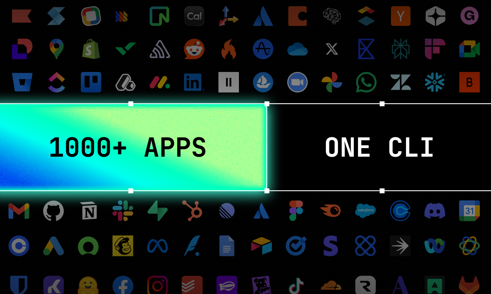

# Composio skills for Hermes



A [Hermes Agent](https://github.com/NousResearch/hermes-agent) skill that teaches the agent to drive [Composio](https://composio.dev) through its local CLI — discovering tools for 1000+ apps (GitHub, Gmail, Slack, Notion, Linear, Jira, …), connecting accounts, inspecting schemas, executing tools, scripting workflows, listening for triggers, and proxying authenticated API calls.

This repo follows the `<org>/skills` convention used by trusted Hermes publishers (e.g. `openai/skills`, `anthropics/skills`).

## Skills

| Skill | Category | Description |
|---|---|---|
| [`composio-cli`](skills/devops/composio-cli/SKILL.md) | devops | Use the local `composio` CLI to find, inspect, and run tools for any connected app. |

## Install

Skills install directly from this public repo by `owner/repo/skill-path`:

```bash
hermes skills install shawnesquivel/composio-hermes-skills/skills/devops/composio-cli
```

Or add the repo as a tap and browse/search its skills:

```bash
hermes skills tap add shawnesquivel/composio-hermes-skills
hermes skills browse
```

## Prerequisites

The `composio-cli` skill calls the local `composio` binary through Hermes' terminal capability. Install it once:

```bash
curl -fsSL https://composio.dev/install | bash
composio login
```

## Test it

```bash
hermes chat --toolsets skills -q "Use the composio-cli skill to find a tool that creates a GitHub issue"
```

## Repository layout

```text
composio-hermes-skills/
├── manifest.json                 # Bundle metadata + skill index
├── skills/
│   └── devops/
│       └── composio-cli/
│           └── SKILL.md          # The skill (YAML frontmatter + workflow)
└── docs/                         # Authoring references (Hermes + OpenAI skill specs)
```

## Authoring

Each skill is a `SKILL.md` with YAML frontmatter under `skills/<category>/<name>/`. See [`docs/Hermes - Creating Skills.md`](docs/Hermes%20-%20Creating%20Skills.md) for the full format, and the existing [`composio-cli`](skills/devops/composio-cli/SKILL.md) skill as a reference.

## License

MIT
